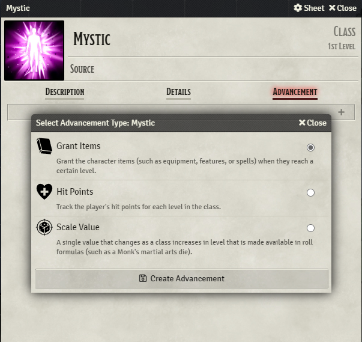
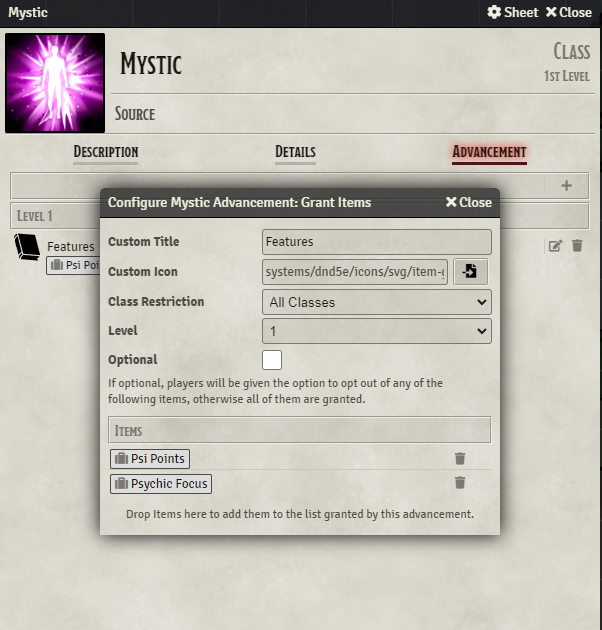
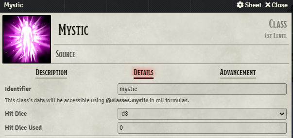
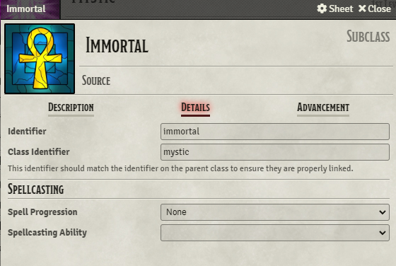

## Advancement System

The advancement system is a new system in 5e that allows classes, subclasses, and backgrounds to make modifications to the character when they are added and when a character levels up.

#### Disabling Advancements

The advancement system can be disabled for all players in a world by using the `"Disable level-up automation"` option in the 5e system settings. To avoid running advancements on an individual character, any advancements should be removed from the class, subclass, or background before it is dropped on the character sheet.


## Advancement Types
### Grant Items
The grant items advancement defines a list of features, spells, or other items that are added to the actor at a certain level.

### Hit Points *(class only)*
The hit points advancement keeps track of hit point values for each level of a class. The player will have an option for rolling their hit points or taking the average value.

### Scale Value *(class or subclass only)*
Scale values are formula values that change arbitrarily depending on the level of the class or subclass to which they belong. These values are then made available to be used in roll formulas or elsewhere in the system. A few examples of this include a Bard's inspiration die size, a Rogue's sneak attack value, or a Cleric's channel divinity uses.


## Advancement Hooks

Details of the hooks that the advancement system provides can be found on [the hooks page](Hooks#advancement).


## Custom Advancement Types

For module authors who want to expand beyond the advancement types offered in the system, it is a simple task to create and register custom advancement types.

**Note**: The advancement API is brand new and some changes may be made in upcoming releases of 5e. Be aware that changes to the API in 1.7 may break any custom advancements in future versions.

### Authoring

#### `Advancement` Class

All custom types should subclass the abstract `Advancement` type. This class contains all of the base configuration of the advancement, details on its data structure, and methods for displaying it within the advancement list on items and performing changes to the actor when the advancement is applied.

#### `AdvancementConfig` Class

A subclass of `AdvancementConfig` is needed when a custom advancement type needs to present custom configuration options to the user. If no custom config application is provided, the default config window will be shown to allow for customization of the advancement's base settings.

Any custom config templates should contain the base advancement controls partial so those controls are always available:

```html
{{> "systems/dnd5e/templates/advancement/parts/advancement-controls.html"}}
```

#### `AdvancementFlow` Class

The controls presented within the advancement process are defined within a subclass of `AdvancementFlow`. This will always be rendered as a sub-application of the surrounding `AdvancementManager`.

#### Namespacing

Custom advancements introduced by modules should be uniquely namespaced for that module to ensure that future advancement types introduced by the system or other modules do not conflict.

### Registering

The only step required to register a custom advancement type with 5e is to add the new `Advancement` class to the `game.dnd5e.advancement.types` object.

```javascript
Hooks.once("init", () => {
  game.dnd5e.advancement.types.MyModuleCustomAdvancement = MyModuleCustomAdvancement;
});
```

Advancements are looked up by their type. For example, an advancement of type 'MyModuleCustom' will be loaded by the `MyModuleCustomAdvancement` class, if it can be found.

Advancement registration should be done during a module's `"init"` or `"setup"` hooks to ensure that the custom type is available during item preparation.

If at any point a module that introduces a custom advancement is disabled, the system will simply skip preparing that advancement while retaining the underlying data in case the advancement is ever re-added.

## Custom Class Example
Content that may have been modifying the old `CONFIG.DND5E.classFeatures` object in order to add feature progression for custom classes should instead configure advancements directly on those class items using the new system. Since this data is stored on the class item itself, it can be placed directly inside a compendium and requires no additional script support to plug-into the system.

### Features
To add features to a class, go to the class' 'Advancement' tab, click the '+' sign to add a new advancement, and select the 'Item Grant' advancement.



Select the level at which these features are gained, then drag-and-drop the feature items to the bottom section of the sheet.



**Note:** These items are referenced by UUID so do not use world-level items if you intend this class to be portable between worlds. If you wish to store the class in a compendium to be transferred between worlds, you should also store the features in a compendium (it can be the same one as the class item) and make sure to drag-and-drop from that compendium onto the Item Grant Advancement configuration.

Repeat this process for each level that features are gained in this class.

### Subclasses
Classes and subclasses are linked together by their identifiers. In order to create a subclass for a given class, first locate the class identifier.



Then create the new subclass item and input the parent class' identifier.

